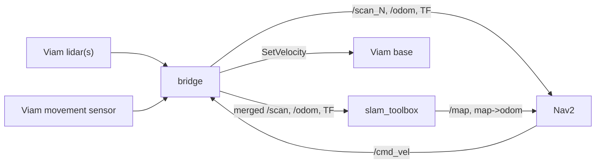

# nav-stack

A Viam navigation stack that wraps the ROS2 **Nav2** and **slam_toolbox** packages,
so any Viam base can map an environment, localize within it, and navigate to named
locations or arbitrary map points while avoiding obstacles.

This module (`viam-labs:nav-stack`) provides two models:

| Model | API | Purpose |
| --- | --- | --- |
| `viam-labs:nav-stack:slam` | `rdk:service:slam` | Mapping + localization via slam_toolbox. Standard SLAM API (live map, position) + map management. |
| `viam-labs:nav-stack:navigation` | `rdk:service:generic` | Nav2 navigation: named locations, go-to-point, keepout/speed zones, obstacle avoidance, all via `DoCommand`. |

## How it works

The module bundles/orchestrates ROS2 and bridges it to your Viam components:

- Reads each Viam lidar -> publishes `/scan_<i>` (per lidar) and a merged `/scan`
  for slam_toolbox.
- Publishes odometry (`/odom`) and the `odom -> base_link` TF from a Viam movement
  sensor; publishes static `base_link -> laser_<i>` TFs from each lidar mount.
- Runs slam_toolbox (mapping or localization) and Nav2 (planner + controller +
  layered costmaps + behavior tree).
- Subscribes Nav2's `/cmd_vel` and drives the Viam base — only while navigating,
  with a watchdog that stops the base if commands go stale.



## Prerequisites

- A Linux host (arm64 or x86_64) running `viam-server` on **Ubuntu 22.04, 24.04, or 26.04**.
  **Pi 5 recommendation:** Ubuntu **24.04 LTS** (Jazzy). Ubuntu 26.04 (Lyrical) may install `ros-base` but Nav2 / slam_toolbox apt packages are often missing on arm64 until ROS publishes them for that distro.
- On first deploy, `setup.sh` runs automatically (`first_run` in `meta.json`) and will:
  1. Verify the Ubuntu version and pick a matching ROS 2 distro (LTS default):
     - 22.04 → **Humble**
     - 24.04 → **Jazzy** (set `ROS_DISTRO=kilted` for Kilted Kaiju)
     - 26.04 → **Lyrical Luth**
  2. **Install** ROS 2, Nav2, and slam_toolbox via `apt` if they are missing (`AUTO_INSTALL_DEPS=1`, the default).
  3. Create the Python venv and install pip dependencies.
  4. Write `.ros_env` so `run.sh` can source ROS without a manual module env block.

Set `AUTO_INSTALL_DEPS=0` in the module `env` block to only check and fail if system packages are missing.

`ROS_ENV` in the module config is **optional** after `setup.sh` has run; override it when you want a non-default distro (e.g. Kilted on 24.04):

```json
"env": {
  "ROS_DISTRO": "kilted",
  "AUTO_INSTALL_DEPS": "1"
}
```

Manual install (if you prefer to provision the image yourself):

```bash
sudo apt-get install ros-$ROS_DISTRO-ros-base \
                     ros-$ROS_DISTRO-navigation2 \
                     ros-$ROS_DISTRO-nav2-bringup \
                     ros-$ROS_DISTRO-slam-toolbox
```

- A configured Viam **base**, one or more **lidars** (configured as `camera`
  components returning point clouds; a true 2D lidar is ideal, depth cameras work
  via projection), and a **movement sensor** providing velocity for odometry.

If `viam-server` runs as root and DDS shared-memory fails, point
`FASTRTPS_DEFAULT_PROFILES_FILE` at a UDP-only FastDDS profile in the module env.

## Configuration

### SLAM service

```json
{
  "name": "slam",
  "api": "rdk:service:slam",
  "model": "viam-labs:nav-stack:slam",
  "attributes": {
    "base": "my-base",
    "movement_sensor": "odometry",
    "lidars": [
      { "name": "front-lidar", "mount": { "x": 0.2, "y": 0.0, "theta": 0.0 } },
      { "name": "rear-lidar",  "mount": { "x": -0.2, "y": 0.0, "theta": 3.14159 } }
    ],
    "mode": "mapping",
    "maps_dir": "/root/.viam/nav-stack/maps",
    "active_map": "ground-floor"
  }
}
```

A single lidar can be given as `"lidar": "front-lidar"`.

**Tuning via Viam config (no YAML editing required):**

| Attribute | Service | Description |
| --- | --- | --- |
| `mode` | SLAM | `mapping` or `localizing` — selects slam_toolbox node and sets its mode |
| `base_velocity_convention` | SLAM | `ros` (default) or `mir` — maps Nav2 `/cmd_vel` to Viam base `SetVelocity` axes |
| `slam_toolbox` | SLAM | Common slam_toolbox params (resolution, max_laser_range, etc.) |
| `slam_params` | SLAM | Advanced: any other slam_toolbox ROS param (merged last) |
| `robot_radius`, `max_vel_x`, … | Nav | Top-level Nav2 footprint / velocity limits |
| `nav2` | Nav | Common Nav2 params (goal tolerance, costmap size, etc.) |
| `nav2_params` | Nav | Advanced: nested Nav2 param overrides (merged last) |

Example with slam_toolbox tuning:

```json
{
  "name": "slam",
  "model": "viam-labs:nav-stack:slam",
  "attributes": {
    "base": "my-base",
    "movement_sensor": "odometry",
    "lidars": [{ "name": "front-lidar" }],
    "mode": "localizing",
    "maps_dir": "/root/.viam/nav-stack/maps",
    "active_map": "ground-floor",
    "slam_toolbox": {
      "resolution": 0.05,
      "max_laser_range": 25.0,
      "minimum_travel_distance": 0.3,
      "map_update_interval": 1.0
    }
  }
}
```

`mode` changes take effect on reconfigure (or via `start_mapping` / `start_localizing` DoCommands).

For **MiR250** bases (`viam-labs:mir-base`), set `"base_velocity_convention": "mir"` so forward Nav2 commands map to Viam `linear.y` (MiR expects forward on Y, not X). Odometry from `viam-labs:mir-base:movement` stays in ROS convention and does not need swapping.

For **MiR** movement sensors (`viam-labs:mir-base:movement`), the bridge reads a single `get_readings()` per odom tick. It uses **`odom_position_x_m` / `odom_position_y_m` / `odom_yaw_deg`** when present (true `/odom` frame from mir-base ≥ the odom-fields update). Map-frame `position_x_m`/`position_y_m` and fused `yaw_deg` are **not** used for `/odom` — slam_toolbox needs a smooth odom frame. Until mir-base exposes the odom fields, orientation falls back to velocity integration; upgrade mir-base or patch it to publish `odom_*` keys from the parsed `/odom` message. Raise `mir_rosbridge_timeout_s` (≥5) and `odom_rate_hz` (≥15) if updates lag.

### Navigation service

```json
{
  "name": "nav",
  "api": "rdk:service:generic",
  "model": "viam-labs:nav-stack:navigation",
  "attributes": {
    "slam_service": "slam",
    "base": "my-base",
    "kinematics": "differential",
    "robot_radius": 0.22,
    "max_vel_x": 0.4,
    "max_vel_theta": 1.0,
    "inflation_radius": 0.45,
    "nav2": {
      "xy_goal_tolerance": 0.25,
      "local_costmap_width": 4.0,
      "cost_scaling_factor": 3.0
    }
  }
}
```

Set `"kinematics": "omni"` and a non-zero `max_vel_y` for omnidirectional bases.

The files under [`params/`](params/) are **reference defaults** shipped with the module; runtime params are generated from your Viam service attributes.

## Workflows

### 1. Make a map

1. Configure the SLAM service with `"mode": "mapping"` (or call `start_mapping`).
2. Drive the base around manually (Viam remote control / SDK). The module only
   takes over the base while navigating, so manual driving and mapping don't
   conflict.
3. Save when done: `do_command({"command": "save_map"})`.

### 2. Localize on a saved map

```python
await slam.do_command({"command": "start_localizing", "map": "ground-floor"})
await slam.do_command({"command": "set_initial_pose", "pose": {"x": 0, "y": 0, "theta": 0}})
```

### 3. Create and use locations

```python
# Save the robot's current spot as "kitchen"
await nav.do_command({"command": "add_location", "name": "kitchen"})
# Or specify a pose (meters / radians, map frame)
await nav.do_command({"command": "add_location", "name": "dock",
                      "pose": {"x": 1.0, "y": 2.0, "theta": 0.0}})

await nav.do_command({"command": "navigate_to_location", "name": "kitchen"})
await nav.do_command({"command": "navigate_to_point", "x": 3.5, "y": -1.0})
await nav.do_command({"command": "get_status"})
await nav.do_command({"command": "cancel"})
```

Locations CRUD: `add_location`, `get_location`, `list_locations`,
`update_location`, `delete_location` (alias `remove_location`),
`delete_all_locations`.

### 4. Define virtual zones

Physical obstacles are avoided automatically. Virtual zones are user-defined:

```python
# A no-go region
await nav.do_command({"command": "add_zone", "name": "fragile-display",
                      "type": "keepout",
                      "geometry": {"type": "circle", "center": [4.0, 1.5], "radius": 0.8}})
# A slow-down region (30% of max speed)
await nav.do_command({"command": "add_zone", "name": "busy-aisle",
                      "type": "speed_limit", "speed_pct": 30,
                      "geometry": {"type": "polygon",
                                   "points": [[0,0],[2,0],[2,3],[0,3]]}})
```

Zones CRUD: `add_zone`, `get_zone`, `list_zones`, `update_zone`, `delete_zone`,
`delete_all_zones`. Geometry types: `circle`, `box` (optionally `rotation`),
`polygon`. Locations and zones are stored per-map.

### Map management (SLAM service)

`list_maps`, `get_active_map`, `set_active_map`, `rename_map`, `delete_map`,
`start_mapping`, `start_localizing`, `save_map`, `get_mode`, `set_initial_pose`.

## Development

```bash
./setup.sh                 # create venv + verify ROS deps
python -m pytest tests/    # pure-Python unit tests (no ROS needed)
./build.sh                 # package module.tar.gz
```

The geometry/format conversions and the map/location/zone stores have no ROS or
Viam dependency and are unit-tested directly. The ROS bridge, process manager, and
costmap-filter wiring require an on-device ROS2 + Nav2 environment to validate.

## Scope / notes

- 2D ground-robot navigation (slam_toolbox + Nav2 are 2D). One base per service.
- Differential and omnidirectional kinematics supported; Ackermann is out of scope.
- Multi-lidar merging for SLAM assumes roughly coplanar lidars with accurate mount
  transforms; all lidars still contribute to Nav2 obstacle avoidance regardless.
