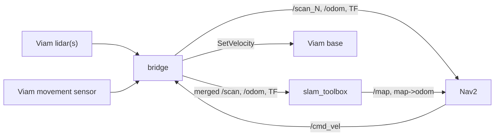

# nav-stack

A Viam navigation stack that wraps the ROS2 **Nav2** and **slam_toolbox** packages,
so any Viam base can map an environment, localize within it, and navigate to named
locations or arbitrary map points while avoiding obstacles.

This module (`viam-labs:nav-stack`) provides three models:

| Model | API | Purpose |
| --- | --- | --- |
| `viam-labs:nav-stack:slam` | `rdk:service:slam` | Mapping + localization via slam_toolbox. Standard SLAM API (live map, position) + map management. |
| `viam-labs:nav-stack:navigation` | `rdk:service:generic` | Nav2 navigation: named locations, go-to-point, keepout/speed zones, obstacle avoidance, all via `DoCommand`. |
| `viam-labs:nav-stack:navigation-external` | `rdk:service:generic` | Same Nav2 navigation, driven by **any** `rdk:service:slam` instead of the bundled slam_toolbox. Runs its own sensor bridge. |

## How it works

The module bundles/orchestrates ROS2 and bridges it to your Viam components:

- Reads each Viam lidar -> publishes `/scan_<i>` (per lidar) and a merged `/scan`
  for slam_toolbox.
- Publishes odometry (`/odom`) and the `odom -> base_link` TF from a Viam movement
  sensor; publishes static `base_link -> laser_<i>` TFs from each lidar mount.
- Runs slam_toolbox (mapping or localization) and Nav2 (planner + controller +
  layered costmaps + behavior tree).
- Subscribes Nav2's `/cmd_vel` and drives the Viam base — only while navigating,
  with a watchdog that stops the base if commands go stale.



## Prerequisites

- A Linux host (arm64 or x86_64) running `viam-server` on **Ubuntu 22.04, 24.04, or 26.04**.
  **Pi 5 recommendation:** Ubuntu **24.04 LTS** (Jazzy). Ubuntu 26.04 (Lyrical) may install `ros-base` but Nav2 / slam_toolbox apt packages are often missing on arm64 until ROS publishes them for that distro.
- On first deploy, `setup.sh` runs automatically (`first_run` in `meta.json`) and will:
  1. Verify the Ubuntu version and pick a matching ROS 2 distro (LTS default):
     - 22.04 → **Humble**
     - 24.04 → **Jazzy** (set `ROS_DISTRO=kilted` for Kilted Kaiju)
     - 26.04 → **Lyrical Luth**
  2. **Install** ROS 2, Nav2, and slam_toolbox via `apt` if they are missing (`AUTO_INSTALL_DEPS=1`, the default).
  3. Create the Python venv and install pip dependencies.
  4. Write `.ros_env` so `run.sh` can source ROS without a manual module env block.

Set `AUTO_INSTALL_DEPS=0` in the module `env` block to only check and fail if system packages are missing.

`ROS_ENV` in the module config is **optional** after `setup.sh` has run; override it when you want a non-default distro (e.g. Kilted on 24.04):

```json
"env": {
  "ROS_DISTRO": "kilted",
  "AUTO_INSTALL_DEPS": "1"
}
```

Manual install (if you prefer to provision the image yourself):

```bash
sudo apt-get install ros-$ROS_DISTRO-ros-base \
                     ros-$ROS_DISTRO-navigation2 \
                     ros-$ROS_DISTRO-nav2-bringup \
                     ros-$ROS_DISTRO-slam-toolbox
```

- A configured Viam **base**, one or more **lidars** (configured as `camera`
  components returning point clouds; a true 2D lidar is ideal, depth cameras work
  via projection), and a **movement sensor** providing velocity for odometry.

If `viam-server` runs as root and DDS shared-memory fails, point
`FASTRTPS_DEFAULT_PROFILES_FILE` at a UDP-only FastDDS profile in the module env.

## Configuration

### SLAM service

```json
{
  "name": "slam",
  "api": "rdk:service:slam",
  "model": "viam-labs:nav-stack:slam",
  "attributes": {
    "base": "my-base",
    "movement_sensor": "odometry",
    "lidars": [
      { "name": "front-lidar", "mount": { "x": 0.2, "y": 0.0, "theta": 0.0 } },
      { "name": "rear-lidar",  "mount": { "x": -0.2, "y": 0.0, "theta": 3.14159 } }
    ],
    "mode": "mapping",
    "maps_dir": "/root/.viam/nav-stack/maps",
    "active_map": "ground-floor"
  }
}
```

A single lidar can be given as `"lidar": "front-lidar"`.

**Tuning via Viam config (no YAML editing required):**

| Attribute | Service | Description |
| --- | --- | --- |
| `mode` | SLAM | `mapping` or `localizing` — selects slam_toolbox node and sets its mode |
| `global_localize_on_start` | SLAM | When `true` in `localizing` mode, run `global_localize` automatically after startup (default `true`) |
| `global_localize_on_start_delay_s` | SLAM | Delay before startup auto-localize (default `4.0`) |
| `global_localize_on_start_options` | SLAM | Optional args merged into startup `global_localize` command; defaults prefer robust boot localization (`full_map: true`, `map_source: live`) |
| `global_localize_on_start_refine` | SLAM | Run a second auto `global_localize` pass after startup (default `true`) |
| `global_localize_on_start_refine_delay_s` | SLAM | Delay before second refine pass (default `8.0`) |
| `global_localize_on_start_refine_max_passes` | SLAM | Max startup refine passes while quality is below target (default `3`) |
| `global_localize_on_start_target_score` | SLAM | Stop refining once score reaches this threshold (default `0.7`) |
| `global_localize_on_start_target_ray_mae_m` | SLAM | Stop refining once ray MAE is at or below this threshold (default `0.4`) |
| `global_localize_on_start_post_apply_refine` | SLAM | Run one delayed post-apply `global_localize` pass (manual-equivalent) after startup (default `true`) |
| `global_localize_on_start_post_apply_refine_delay_s` | SLAM | Delay before post-apply refine pass (default `8.0`) |
| `global_localize_on_start_post_apply_refine_options` | SLAM | Optional args for post-apply refine (default `{ \"map_source\": \"live\" }`) |
| `global_localize_on_start_refine_options` | SLAM | Optional args for refine passes; defaults to local refinement (`full_map: false`, `map_source: live`, `local_yaw_window_deg: 120`, `search_radius_m: 6`) |
| `map_when_still` | SLAM | When `true` (point-cloud lidars only), publish `/scan` once per full stop after dwell, then only if still still after the lidar capture (motion during read aborts). Livox frames densify while stopped. Matcher uses gyro yaw prior with `coarse_search_angle_offset` ≈ ±30°; loop closure stays near stock (`loop_match_minimum_chain_size` 10, `loop_search_maximum_distance` 5 m, fine response ≥ 0.45) to avoid false corridor snaps. Default `false` |
| `map_when_still_dwell_s` | SLAM | Seconds fully stopped before a scan may publish (default `1.0`) |
| `map_when_still_yaw_step_deg` | SLAM | Extra mid-pivot scans every N degrees after dwell (default `0` = full-stop only; set e.g. `15` only if you pause briefly while turning) |
| `map_when_still_max_drift_m` / `_deg` | SLAM | Abort dwell if pose creeps while “still” (defaults `0.03` m / `1.5°`) |
| `wall_yaw_correction` | SLAM | Soft-correct odom yaw from a long side wall in each pause scan (anti-banana). Default `true` when `map_when_still` + point-cloud lidars |
| `wall_yaw_min_length_m` / `wall_yaw_max_step_deg` / `wall_yaw_blend` | SLAM | Wall fit length gate (default `2.0` m), max yaw step per pause (default `2°`), and blend toward the wall (default `0.5`) |
| `mapping_revisit_check` | SLAM | Mapping-time revisit watchdog: periodically scan-match against the live map near the current pose and shift the odom TF when a strong match disagrees, so a revisited corridor links up instead of duplicating. Default `true` when `map_when_still` + point-cloud lidars |
| `mapping_revisit_interval_s` / `_search_radius_m` / `_wide_radius_m` | SLAM | Check interval (default `20` s) and tiered search radii: local first (default `5` m), wider on weak match (default `12` m) |
| `mapping_revisit_min_score` / `_max_ray_mae_m` / `_full_map_min_score` | SLAM | Match quality gates (defaults `0.6` / `0.8` m); full-map fallback needs the stricter `0.75` score since self-similar offices produce convincing wrong corridors |
| `mapping_revisit_min_shift_m` / `_min_shift_deg` / `_max_shift_m` | SLAM | Correct only when the match moved at least `1.0` m / `10°` from the current pose and no more than `10` m (larger = likely false match) |
| `movement_sensor_yaw_deg` | SLAM | Yaw (degrees) of the movement sensor's +x axis relative to robot forward. Wit silk-screen Y forward with reverse +Y accel usually needs `90`; geometric Y-forward with correct-signed +Y needs `-90`. Pick the sign that makes forward drive produce positive robot-X velocity (default `0`) |
| `map_pose_yaw_offset_deg` | SLAM | Added to `GetPosition` yaw only (App arrow vs map). Prefer lidar `mount.theta` — park facing a wall and check status `nearest_return_bearing_deg` / `suggested_mount_theta_deg`. Cosmetics (±45) do not fix ghost walls (default `0`) |
| `heading_sensor_yaw_deg` | SLAM | Same mount-yaw correction for the dedicated `heading_sensor` (default `0`) |
| lidar `mount.pitch`, `mount.roll` | SLAM | Mount tilt in radians (positive pitch = forward axis tilted down). Levels the cloud before z filtering — even a ~2° mast tilt pulls floor returns into the z band at 15–20 m and imprints phantom borders at max range (default `0`) |
| `base_velocity_convention` | SLAM | `ros` (default) or `mir` — maps Nav2 `/cmd_vel` to Viam base `SetVelocity` axes |
| `scan_max_age_s` | SLAM | Safety cutoff for the `/scan` publish path: if the lidar reports a cache age (`get_laser_scan` `age_s`) above this, skip publishing that cycle rather than feed SLAM/Nav2 a stale, misregistered scan (default `2.0`) |
| `slam_toolbox` | SLAM | Common slam_toolbox params (resolution, max_laser_range, etc.) |
| `slam_params` | SLAM | Advanced: any other slam_toolbox ROS param (merged last) |
| `robot_radius`, `max_vel_x`, … | Nav | Top-level Nav2 footprint / velocity limits |
| `nav2` | Nav | Common Nav2 params (goal tolerance, costmap size, etc.) |
| `nav2_params` | Nav | Advanced: nested Nav2 param overrides (merged last) |

Example with slam_toolbox tuning:

```json
{
  "name": "slam",
  "model": "viam-labs:nav-stack:slam",
  "attributes": {
    "base": "my-base",
    "movement_sensor": "odometry",
    "lidars": [{ "name": "front-lidar" }],
    "mode": "localizing",
    "maps_dir": "/root/.viam/nav-stack/maps",
    "active_map": "ground-floor",
    "global_localize_on_start": true,
    "global_localize_on_start_options": {
      "map_source": "live",
      "full_map": true
    },
    "global_localize_on_start_refine": true,
    "global_localize_on_start_refine_delay_s": 8.0,
    "global_localize_on_start_refine_max_passes": 3,
    "global_localize_on_start_target_score": 0.7,
    "global_localize_on_start_target_ray_mae_m": 0.4,
    "global_localize_on_start_post_apply_refine": true,
    "global_localize_on_start_post_apply_refine_delay_s": 8.0,
    "global_localize_on_start_post_apply_refine_options": {
      "map_source": "live"
    },
    "global_localize_on_start_refine_options": {
      "local_yaw_window_deg": 120.0
    },
    "slam_toolbox": {
      "resolution": 0.05,
      "max_laser_range": 25.0,
      "minimum_travel_distance": 0.3,
      "map_update_interval": 1.0
    }
  }
}
```

Startup auto-localize evaluates candidate poses first (`apply: false`) and only
publishes the best pose at the end, so early weak passes do not lock in a bad seed.

**Scan freshness / capture-time stamping.** When the lidar (e.g. `viam-labs:mir-base`)
reports a per-scan cache age (`age_s`) in its `get_laser_scan` output, the bridge
stamps the published scan at its capture time (`read_start - age_s`) instead of read
time. This keeps obstacles and scan-match registered where the robot actually was
when the scan was captured — important on a moving/rotating robot where a cached
scan stamped "now" would smear geometry and drive localization off. Scans older than
`scan_max_age_s` are dropped for the SLAM path. Producers that don't report `age_s`
fall back to read-time stamping (unchanged behavior).

`mode` changes take effect on reconfigure (or via `start_mapping` / `start_localizing` DoCommands).

For a **bare IMU** movement sensor (Wit, etc. with accel + gyro, no wheel pose), `/odom` yaw is integrated from **gyro Z only**. Absolute `orientation` / AHRS yaw from `get_readings()` is not snapped into the odom pose. With `map_when_still`, published TF **XY stays frozen** (IMU accel must not be the slam prior) while gyro yaw still updates for the App arrow; slam_toolbox always consumes that odom→base TF as its match prior — there is no real `use_odometry: false` switch. Defaults set `coarse_search_angle_offset` ≈ ±30° around that gyro prior (not ±180° — that caused false room-orientation ghosts). **Duplicated corridors after driving a loop** are usually failed loop closure (gyro drift) — pause often facing clear walls and prefer smaller circuits. Do **not** loosen `loop_match_minimum_chain_size` / `loop_search_*` aggressively; that trades missed closures for false corridor snaps and warped ghost maps.

**Wall-line yaw correction (anti-banana).** Long straight walls drawn as curves usually mean gyro heading walked off while driving parallel to the wall. With `map_when_still` + point-cloud lidars, `wall_yaw_correction` defaults **on**: each accepted pause scan looks for a long side wall (≥ `wall_yaw_min_length_m`) and soft-corrects `/odom` yaw by at most `wall_yaw_max_step_deg` (blended by `wall_yaw_blend`) so the wall lines up with robot +X. Status field `wall_yaw` reports the last observation. Disable with `"wall_yaw_correction": false` if a cluttered side repeatedly misleads the fit.

For **MiR250** bases (`viam-labs:mir-base`), set `"base_velocity_convention": "mir"` so forward Nav2 commands map to Viam `linear.y` (MiR expects forward on Y, not X). Odometry from `viam-labs:mir-base:movement` stays in ROS convention and does not need swapping. Nav-stack stops Nav2 motion with `set_velocity(0)` (not `Base.stop()`), so MiR Manualcontrol and `go_to_location` keep working after a navigation cancel or goal completion.

The MiR250 is **differential drive** — use `"kinematics": "differential"` (the default). Configuring `omni` (or an `Omni` MPPI motion model) makes Nav2 command lateral velocities the robot cannot execute, which stalls progress near goals and triggers endless spin recoveries. Also avoid `"vx_min": 0`: with reverse disabled, a diff-drive robot must rotate fully around to correct small overshoots.

For **MiR** movement sensors (`viam-labs:mir-base:movement`), the bridge reads a single `get_readings()` per odom tick. It uses **`odom_position_x_m` / `odom_position_y_m` / `odom_yaw_deg`** when present (true `/odom` frame from mir-base ≥ the odom-fields update). Map-frame `position_x_m`/`position_y_m` and fused `yaw_deg` are **not** used for `/odom` — slam_toolbox needs a smooth odom frame. Until mir-base exposes the odom fields, orientation falls back to velocity integration; upgrade mir-base or patch it to publish `odom_*` keys from the parsed `/odom` message. Raise `mir_rosbridge_timeout_s` (≥5) and `odom_rate_hz` (≥15) if updates lag.

### Navigation service

```json
{
  "name": "nav",
  "api": "rdk:service:generic",
  "model": "viam-labs:nav-stack:navigation",
  "attributes": {
    "slam_service": "slam",
    "base": "my-base",
    "kinematics": "differential",
    "robot_radius": 0.22,
    "max_vel_x": 0.4,
    "max_vel_theta": 1.0,
    "inflation_radius": 0.45,
    "nav2": {
      "xy_goal_tolerance": 0.25,
      "local_costmap_width": 4.0,
      "cost_scaling_factor": 3.0
    }
  }
}
```

Set `"kinematics": "omni"` and a non-zero `max_vel_y` for omnidirectional bases.

The files under [`params/`](params/) are **reference defaults** shipped with the module; runtime params are generated from your Viam service attributes.

### Navigation with an external SLAM service

Use `viam-labs:nav-stack:navigation-external` to drive Nav2 from **any** `rdk:service:slam` (for example a third-party RTAB-Map module), instead of the bundled `slam_toolbox`. Same DoCommand surface as `navigation`; the difference is that this model runs its **own** sensor bridge and bridges the external SLAM's pose + occupancy grid into ROS:

- `slam_service` names an `rdk:service:slam` dependency. The adapter calls its standard `GetPosition()` (→ `map → odom` TF) and a `get_grid` DoCommand returning `{rows, cols, xMin, yMin, cellSize, data}` with int8 cells (`-1`/`0`/`100`) (→ `/map` OccupancyGrid). No point-cloud rasterization.
- Because the external SLAM does not publish `/scan` or `/odom`, you configure the sensor bridge here too — `lidars` (Viam `camera` components, projected to `/scan`) and `movement_sensor`. It reuses the same bridge + odometry fusion as the SLAM model.
- The movement sensor is read via the **typed** `MovementSensor` API (`GetProperties()` then `AngularVelocity` / `LinearAcceleration` / `Orientation` / `LinearVelocity`), not `GetReadings()`, so any movement sensor works. An IMU-only sensor (e.g. a Livox Mid-360's IMU) auto-selects yaw-from-gyro + translation-from-lidar-odometry; its dead-reckoned `Position` is ignored unless you set `trust_movement_sensor_pose: true`.

```json
{
  "name": "nav",
  "api": "rdk:service:generic",
  "model": "viam-labs:nav-stack:navigation-external",
  "attributes": {
    "slam_service": "rtabmap",
    "base": "my-base",
    "kinematics": "differential",
    "lidars": [{ "name": "mid360", "scan_source": "point_cloud" }],
    "movement_sensor": "mid360-imu",
    "imu_odom_mode": "accel_only",
    "lidar_odom_enabled": true,
    "robot_radius": 0.22,
    "max_vel_x": 0.4,
    "inflation_radius": 0.45
  }
}
```

Optional attributes: `trust_movement_sensor_pose` (default `false`), `snap_heading` (default `false`), plus the same bridge/odometry tuning fields as the SLAM service and the same `nav2` block as `navigation`. The built-in `navigation` model is unchanged; use it when you map with `nav-stack:slam`.

## Workflows

### 1. Make a map

1. Configure the SLAM service with `"mode": "mapping"` (or call `start_mapping`).
2. Drive the base around manually (Viam remote control / SDK). The module only
   takes over the base while navigating, so manual driving and mapping don't
   conflict.
3. Save when done: `do_command({"command": "save_map"})`.

### 2. Localize on a saved map

```python
await slam.do_command({"command": "start_localizing", "map": "ground-floor"})
await slam.do_command({"command": "set_initial_pose", "pose": {"x": 0, "y": 0, "theta": 0}})
```

If the nav-stack map is aligned with the MiR onboard map, seed from the MiR pose instead
(continuous laser matching on the MiR side; nav-stack still needs one `/initialpose` seed):

```python
await slam.do_command({
    "command": "start_localizing",
    "map": "ground-floor",
    "use_mir_pose": True,
})
# or after localizing:
await slam.do_command({"command": "relocalize", "use_mir_pose": True})
```

**Preferred:** match live lidar against the saved nav-stack occupancy map (no MiR map pose):

```python
await slam.do_command({"command": "global_localize"})
# search the whole map when pose is unknown:
await slam.do_command({"command": "global_localize", "full_map": True})
# narrow search around a rough guess (meters):
await slam.do_command({
    "command": "global_localize",
    "pose": {"x": 1.0, "y": 2.0, "theta": 0.0},
    "search_radius_m": 6.0,
})
# preview-only (do not publish /initialpose yet):
await slam.do_command({"command": "global_localize", "apply": False})
```

Returned fields include `pose`, `score`, `candidates_evaluated`, `scan_points_used`,
`in_map_points`, `hit_rate`, `ray_score`, and `ray_mae_m`. If `in_map_points` is
low or `ray_mae_m` is high, the match is unreliable.
Speed/robustness knobs: `local_yaw_window_deg`, `coarse_position_step_m`,
`coarse_yaw_step_deg`, `max_scan_points`, `min_in_map_points`,
`min_in_map_ratio`, `hit_radius_cells`, `ray_refine_candidates`,
`ray_refine_beams`, `ray_step_m`, `ray_weight`.

By default, `global_localize` now auto-falls back to full-map search when local
search quality is weak. Tune or disable with `auto_full_map_fallback`,
`fallback_score_threshold`, and `fallback_hit_rate_threshold`.

When you are roughly in the right place but nav-stack drifted (~2 m), trigger scan-to-map
matching with wider covariance:

```python
await slam.do_command({"command": "relocalize"})
```

### 3. Create and use locations

```python
# Save the robot's current spot as "kitchen"
await nav.do_command({"command": "add_location", "name": "kitchen"})
# Or specify a pose (meters / radians, map frame)
await nav.do_command({"command": "add_location", "name": "dock",
                      "pose": {"x": 1.0, "y": 2.0, "theta": 0.0}})

await nav.do_command({"command": "navigate_to_location", "name": "kitchen"})
await nav.do_command({"command": "navigate_to_point", "x": 3.5, "y": -1.0})
await nav.do_command({"command": "get_status"})
await nav.do_command({"command": "cancel"})

# Force Nav2 to stop and relaunch with freshly generated params (param
# changes normally apply automatically on reconfigure; this is the manual
# override). get_status includes "controller_frequency_loaded" to verify.
await nav.do_command({"command": "restart_nav2"})
```

Locations CRUD: `add_location`, `get_location`, `list_locations`,
`update_location`, `delete_location` (alias `remove_location`),
`delete_all_locations`.

### 4. Define virtual zones

Physical obstacles are avoided automatically. Virtual zones are user-defined:

```python
# A no-go region
await nav.do_command({"command": "add_zone", "name": "fragile-display",
                      "type": "keepout",
                      "geometry": {"type": "circle", "center": [4.0, 1.5], "radius": 0.8}})
# A slow-down region (30% of max speed)
await nav.do_command({"command": "add_zone", "name": "busy-aisle",
                      "type": "speed_limit", "speed_pct": 30,
                      "geometry": {"type": "polygon",
                                   "points": [[0,0],[2,0],[2,3],[0,3]]}})
```

Zones CRUD: `add_zone`, `get_zone`, `list_zones`, `update_zone`, `delete_zone`,
`delete_all_zones`. Geometry types: `circle`, `box` (optionally `rotation`),
`polygon`. Locations and zones are stored per-map.

### Map management (SLAM service)

`list_maps`, `get_active_map`, `set_active_map`, `rename_map`, `delete_map`,
`start_mapping`, `start_localizing`, `save_map`, `get_mode`, `get_status`
(live bridge + slam_toolbox health; optional `probe_sensors: false` to skip a
one-shot lidar/odom read), `set_initial_pose`,
`global_localize` (lidar scan match against saved map; optional `full_map`,
`search_radius_m`, `apply`, `local_yaw_window_deg`, `max_scan_points`,
`auto_full_map_fallback`),
`relocalize` (alias `refine_localization`; optional `pose`, `location`),
`revisit_check` / `get_revisit_check` (mapping-mode revisit watchdog cycle on
demand; optional `apply` to force or dry-run the odom correction).

## Development

```bash
./setup.sh                 # create venv + verify ROS deps
python -m pytest tests/    # pure-Python unit tests (no ROS needed)
./build.sh                 # package module.tar.gz
```

The geometry/format conversions and the map/location/zone stores have no ROS or
Viam dependency and are unit-tested directly. The ROS bridge, process manager, and
costmap-filter wiring require an on-device ROS2 + Nav2 environment to validate.

## Scope / notes

- 2D ground-robot navigation (slam_toolbox + Nav2 are 2D). One base per service.
- Differential and omnidirectional kinematics supported; Ackermann is out of scope.
- Multi-lidar merging for SLAM assumes roughly coplanar lidars with accurate mount
  transforms; all lidars still contribute to Nav2 obstacle avoidance regardless.
