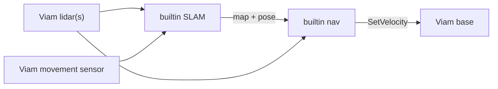

# nav-stack

A Viam navigation stack for mapping, localization, and obstacle-aware navigation
on any Viam base.
The last release that still bundled Nav2/slam_toolbox is preserved at git tag
`pre-ros-removal`.

This module (`viam-labs:nav-stack`) provides:

| Model | API | Purpose |
| --- | --- | --- |
| `viam-labs:nav-stack:slam` | `rdk:service:slam` | Builtin occupancy mapping + localization. |
| `viam-labs:nav-stack:navigation` | `rdk:service:motion` | Builtin MoveOnMap. Named locations, zones, `go_to_*` via `DoCommand`. |
| `viam-labs:nav-stack:navigation-external` | `rdk:service:motion` | Same Motion + DoCommand surface against **any** `rdk:service:slam`. |
| `viam-labs:nav-stack:nav-camera` | `rdk:component:camera` | Renders costmap + plan(s), pose, footprint and goal as a live camera image. |
| `viam-labs:nav-stack:sim-base` | `rdk:component:base` | Simulated base for hardware-free mapping / nav (`SetVelocity` → raycast world). |
| `viam-labs:nav-stack:rplidar` / `wit-imu` / `shm-pointcloud` | camera / movement_sensor | Optional sensor helpers with POSIX shm for low-latency reads. |

## How it works

SLAM and navigation run in-process over Viam APIs (lidar point clouds / shm,
movement sensor, `Base.SetVelocity`). No external navigation stack install is
required.



## Prerequisites

- A host running `viam-server` with Python 3 (Linux is typical; macOS can run the
  builtin path where serial/shm allow).
- On first deploy, `setup.sh` creates the Python venv and installs pip requirements.

## Configuration

### SLAM service

```json
{
  "name": "slam",
  "api": "rdk:service:slam",
  "model": "viam-labs:nav-stack:slam",
  "attributes": {
    "base": "my-base",
    "movement_sensor": "odometry",
    "lidars": [
      { "name": "front-lidar", "mount": { "x": 0.2, "y": 0.0, "theta": 0.0 } },
      { "name": "rear-lidar",  "mount": { "x": -0.2, "y": 0.0, "theta": 3.14159 } }
    ],
    "mode": "mapping",
    "maps_dir": "/root/.viam/nav-stack/maps",
    "active_map": "ground-floor"
  }
}
```

A single lidar can be given as `"lidar": "front-lidar"`.

Per-lidar options include mount pose, `scan_source` (`auto` / `get_laser_scan` /
`point_cloud`), height band (`z_min` / `z_max`), and `obstacles_only` (when
`true`, the sensor is used only for obstacle avoidance — not SLAM matching or
mapping). When `mount` is omitted, the module fills it from the Viam
framesystem (component → `base`), converting Viam's Y-forward base axes into
nav-stack's ROS X-forward mounts so scans align with odom. Explicit `mount`
still wins. Example depth camera for avoidance only:

```json
{
  "name": "depth-cam",
  "scan_source": "point_cloud",
  "obstacles_only": true,
  "cloud_frame": "camera_optical",
  "shm_name": "",
  "max_range": 4.0,
  "min_range": 0.4,
  "z_min": 0.15,
  "z_max": 1.5,
  "mount": { "x": 0.15, "y": 0.0, "z": 0.4, "theta": 0.0 }
}
```

RealSense / OpenCV depth clouds use **optical** axes (Z forward). Set
``cloud_frame: "camera_optical"`` so depth is remapped to X-forward before the
mount and height band; without it, depth collapses into Z and paints a blob on
the robot in the local costmap. Refresh rate is nav-side
``obstacles_only_rate_hz`` (default `5`); set a POSIX ``shm_name`` (or use
``shm-pointcloud``) before pushing toward 10–20 Hz.
**Tuning via Viam config (no YAML editing required):**

| Attribute | Service | Description |
| --- | --- | --- |
| `mode` | SLAM | `mapping` or `localizing` — selects builtin SLAM node and sets its mode |
| `global_localize_on_start` | SLAM | When `true` in `localizing` mode, run `global_localize` automatically after startup (default `true`) |
| `global_localize_on_start_delay_s` | SLAM | Delay before startup auto-localize (default `4.0`) |
| `global_localize_on_start_options` | SLAM | Optional args merged into startup `global_localize` command; defaults prefer robust boot localization (`full_map: true`, `map_source: live`, finer coarse grid / stronger ray weight) |
| `periodic_relocalize` | SLAM | Background scan-to-map watchdog while localizing (default `false`) |
| `periodic_relocalize_during_navigation` | SLAM | Allow periodic relocalize while MoveOnMap is active (default `false`; soft-holds during nav were disruptive) |
| `nav_scan_track` | SLAM | While navigating, apply small continuous scan-match nudges (≤ `0.15` m / `3°`, blended, at most `5` cm / `1°` per match) when the published pose already fits the scan (score ≥ `0.25`), the match is good (≥ `0.35`), and the base is not spinning. Large jumps stay refused during nav. Default `true` |
| `global_localize_on_start_refine` | SLAM | Run a second auto `global_localize` pass after startup (default `true`) |
| `global_localize_on_start_refine_delay_s` | SLAM | Delay before second refine pass (default `8.0`) |
| `global_localize_on_start_refine_max_passes` | SLAM | Max startup refine passes while quality is below target (default `3`) |
| `global_localize_on_start_target_score` | SLAM | Stop refining once score reaches this threshold (default `0.7`) |
| `global_localize_on_start_target_ray_mae_m` | SLAM | Stop refining once ray MAE is at or below this threshold (default `0.4`) |
| `global_localize_on_start_post_apply_refine` | SLAM | Run one delayed post-apply `global_localize` pass (manual-equivalent) after startup (default `true`) |
| `global_localize_on_start_post_apply_refine_delay_s` | SLAM | Delay before post-apply refine pass (default `8.0`) |
| `global_localize_on_start_post_apply_refine_options` | SLAM | Optional args for post-apply refine (default `{ \"map_source\": \"live\" }`) |
| `global_localize_on_start_refine_options` | SLAM | Optional args for refine passes; defaults to local refinement (`full_map: false`, `map_source: live`, `local_yaw_window_deg: 120`, `search_radius_m: 6`) |
| `map_when_still` | SLAM | When `true` (point-cloud lidars only), publish `/scan` once per full stop after dwell, then only if still still after the lidar capture (motion during read aborts). Livox frames densify while stopped. Matcher uses gyro yaw prior with `coarse_search_angle_offset` ≈ ±30°; loop closure stays near stock (`loop_match_minimum_chain_size` 10, `loop_search_maximum_distance` 5 m, fine response ≥ 0.45) to avoid false corridor snaps. Default `false` |
| `map_when_still_dwell_s` | SLAM | Seconds fully stopped before a scan may publish (default `1.0`) |
| `map_when_still_yaw_step_deg` | SLAM | Extra mid-pivot scans every N degrees after dwell (default `0` = full-stop only; set e.g. `15` only if you pause briefly while turning) |
| `map_when_still_max_drift_m` / `_deg` | SLAM | Abort dwell if pose creeps while “still” (defaults `0.03` m / `1.5°`) |
| `wall_yaw_correction` | SLAM | Soft-correct odom yaw from a long side wall in each pause scan (anti-banana). Default `true` when `map_when_still` + point-cloud lidars |
| `wall_yaw_min_length_m` / `wall_yaw_max_step_deg` / `wall_yaw_blend` | SLAM | Wall fit length gate (default `2.0` m), max yaw step per pause (default `2°`), and blend toward the wall (default `0.5`) |
| `mapping_revisit_check` | SLAM | Mapping-time revisit watchdog: periodically scan-match against the live map near the current pose and shift the odom TF when a strong match disagrees, so a revisited corridor links up instead of duplicating. Default `true` when `map_when_still` + point-cloud lidars |
| `mapping_revisit_interval_s` / `_search_radius_m` / `_wide_radius_m` | SLAM | Check interval (default `20` s) and tiered search radii: local first (default `5` m), wider on weak match (default `12` m) |
| `mapping_revisit_min_score` / `_max_ray_mae_m` / `_full_map_min_score` | SLAM | Match quality gates (defaults `0.6` / `0.8` m); full-map fallback needs the stricter `0.75` score since self-similar offices produce convincing wrong corridors |
| `mapping_revisit_min_shift_m` / `_min_shift_deg` / `_max_shift_m` | SLAM | Correct only when the match moved at least `1.0` m / `10°` from the current pose and no more than `10` m (larger = likely false match) |
| `mapping_revisit_slice_verify` | SLAM | Multi-height-slice veto for revisit corrections (3D lidar only). The 2D map holds one z-band silhouette and desk clutter is self-similar in it; this records sparse per-band grids (knee + head height by default) from trusted pause scans and rejects a proposed correction whose pose disagrees with any band that has reference data there. Default `true` |
| `mapping_revisit_slice_bands` / `_slice_min_hit_rate` / `_slice_resolution_m` | SLAM | Extra height bands as `[z_min, z_max]` pairs in meters (default `[[0.15, 0.45], [1.6, 2.4]]`), per-band hit-rate gate (default `0.4`), and grid cell size (default `0.15` m) |
| `mapping_revisit_keyframes` | SLAM | Store a pause keyframe (2D endpoints + height slices + map pose) on every accepted `map_when_still` `/scan` publish, and match against those views when occupancy revisit scores are weak — helps when you stop at different places/angles than the first visit. Default `true` |
| `mapping_revisit_keyframe_min_spacing_m` / `_deg` / `_max` / `_match_tol_m` / `_min_score` | SLAM | Keyframe dedupe spacing (default `0.5` m / `20°`), max stored frames (`250`), NN match tolerance (`0.3` m), and accept threshold (`0.55` hit-rate) |
| `movement_sensor_yaw_deg` | SLAM | Yaw (degrees) of the movement sensor's +x axis relative to robot forward. Wit silk-screen Y forward with reverse +Y accel usually needs `90`; geometric Y-forward with correct-signed +Y needs `-90`. Pick the sign that makes forward drive produce positive robot-X velocity (default `0`) |
| `map_pose_yaw_offset_deg` | SLAM | Added to `GetPosition` yaw only (App arrow vs map). Prefer lidar `mount.theta` — park facing a wall and check status `nearest_return_bearing_deg` / `suggested_mount_theta_deg`. Cosmetics (±45) do not fix ghost walls (default `0`) |
| `heading_sensor_yaw_deg` | SLAM | Same mount-yaw correction for the dedicated `heading_sensor` (default `0`) |
| `gyro_still_threshold_dps` | `wit-imu` | Gyro "still" threshold (register `0x61`) sent on every start, not saved to flash. The factory `0` lets the firmware auto-zero any steady turn: a smooth 5°/s turn lost >90% of its yaw on tracer2a, so nav's gentle steering corrections walked the heading off. `0.05` tracks slow turns within ~0.5% with no drift at rest. `null` leaves the device setting alone (default `0.05`) |
| lidar `mount.pitch`, `mount.roll` | SLAM | Mount tilt in radians (positive pitch = forward axis tilted down). Levels the cloud before z filtering — even a ~2° mast tilt pulls floor returns into the z band at 15–20 m and imprints phantom borders at max range (default `0`) |
| `base_velocity_convention` | SLAM | `viam` (default, Y-forward) or `ros` (X-forward); legacy `mir` accepted as alias for `viam` — maps builtin nav `cmd_vel` to Viam base `SetVelocity` axes |
| `scan_max_age_s` | SLAM | Safety cutoff for the `/scan` publish path: if the lidar reports a cache age (`get_laser_scan` `age_s`) above this, skip publishing that cycle rather than feed SLAM/builtin nav a stale, misregistered scan (default `2.0`) |
| `scan_rate_hz` / `odom_rate_hz` | SLAM | Builtin SLAM tick rate is `max(scan_rate_hz, odom_rate_hz)` (default `10` each). Scan matching stays throttled (~3 Hz) separately |
| `control_rate_hz` | Nav | Builtin nav control rate (default `10`). Local costmap refreshes separately (`builtin.local_costmap_rate_hz`, default `5`) so follower ticks stay cheap |
| `localize_subprocess` | SLAM | Run `global_localize` / periodic relocalize scoring in a dedicated subprocess so the matcher never holds this process's GIL (default `true`). Falls back in-process on error; health in `status.localize_worker` |
| `obstacles_only_rate_hz` | Nav | Background refresh rate for `obstacles_only` depth cams (default `5`). Control tick never awaits GetPointCloud; prefer POSIX `shm_name` for 10–20 Hz |
| `periodic_relocalize_still_bad_score` | SLAM | While still, if tick match score ≤ this (default `0`), run full-map `global_localize` immediately instead of a local peek. |
| `periodic_relocalize_bypass_startup_after_s` | SLAM | Cancel a stuck startup localize after this many seconds (default `90`) so the drift watchdog can recover. |
| `builtin SLAM` | SLAM | Common builtin SLAM params (resolution, max_laser_range, etc.) |
| `slam_params` | SLAM | Advanced map/scan tuning keys (merged into engine defaults) |
| `robot_radius`, `max_vel_x`, … | Nav | Top-level footprint / velocity limits. `robot_radius` also sizes the reactive stop: any live return inside the body-width corridor ahead (not just the ±35° cone) counts as forward clearance, and the live "path blocked" check samples a 0.10 m band around the route |
| `clearance_m` | Nav | **Hard buffer past the body, on each side** (default `0.2` m). Same inscribed radius for the global planner costmap and the local costmap: half-width (or `robot_radius`) + `clearance_m`. Soft inflation, if any, starts outside this. Set `0` for a body-only hard disk |
| `inflation_margin_m` | Nav | Optional soft-cost band **past the hard clearance** (additive). E.g. a 0.295 m half-width with `clearance_m: 0.2` and `inflation_margin_m: 0.05` is hard out to 0.495 m and soft out to 0.545 m |
| `local_inflation_margin_m` | Nav | Extra soft band past the hard clearance for **live scan hits** in the rolling local costmap (additive). Unset means live hits are hard-clearance only |
| `footprint_width_m`, `footprint_length_m` | Nav | **Recommended for non-square robots.** Given both, planning clearance uses the half-**width** (what must fit through a gap) while rotating in place is gated on the half-**diagonal** (what the body sweeps). A single `robot_radius` has to cover both, so it must be the half-diagonal — which seals every gap narrower than `2 × robot_radius` even where the robot easily fits (a 0.59 m-wide robot refusing an 0.84 m doorway). Also sizes the forward stop bubble from the bumper (half-length) and the skid-steer arc envelope from the track. Omit to keep the legacy single-circle behaviour |
| `xy_goal_tolerance`, `yaw_goal_tolerance` | Nav | Goal arrival tolerances (m / rad). Also accepted under `builtin` |
| `timeout_s` | Nav (`builtin`) | Minimum per-goal timeout (default `300`). Long routes get 3× their full-speed drive time instead (`3 × length / max_vel_x`); time stopped for localization does not count |
| `nav_loc_refine_on_disagree` | Nav (`builtin`) | When the current lidar scan is a poor explanation of the map at the published pose, stop, run a local `check_localization`, then resume. After two tries, keep the published pose and the goal (does **not** fail as `localization_lost`). Applies a local shift up to `1.0` m / `30°` when it beats the prior and score ≥ `0.35`. Does **not** enable `periodic_relocalize_during_navigation` |
| `nav_loc_refine_margin_m` / `_map_max_m` / `_min_frac` / `_min_beams` | Nav (`builtin`) | A beam counts when the map claims a wall within `2.5` m; it votes bad-loc when lidar is ≥ `0.8` m farther. Trigger at `22%` of those beams. A second try runs only when the residual is still severe; the path is replanned only if the refine moved the pose |
| `nav_loc_refine_max_tries` / `_cooldown_s` / `_period_s` / `_check_every_m` | Nav (`builtin`) | Two local refine attempts (default), `5` s between them, check about every `0.75` s or `2` m of travel |
| `nav_loc_refine_apply_max_m` / `_apply_max_deg` / `_apply_min_score` | Nav (`builtin`) | Force-apply cap (default `1.0` m / `30°` / score `0.35`). A 2 m / 0.17 twin is still refused |
| `min_cmd_vel_x`, `min_cmd_vel_theta` | Nav | Optional stiction floors (default **off** / `0`) for simple `go_to_*` motion. Legacy aliases: `simple_min_vel_x` / `simple_min_vel_theta` |
| `resolution`, `max_laser_range` | SLAM | Map cell size (m) and lidar range used for matching/mapping. Also accepted under `map` |

Example with map resolution tuning:

```json
{
  "name": "slam",
  "model": "viam-labs:nav-stack:slam",
  "attributes": {
    "base": "my-base",
    "movement_sensor": "odometry",
    "lidars": [{ "name": "front-lidar" }],
    "mode": "localizing",
    "maps_dir": "/root/.viam/nav-stack/maps",
    "active_map": "ground-floor",
    "resolution": 0.05,
    "max_laser_range": 25.0,
    "global_localize_on_start": true,
    "global_localize_on_start_options": {
      "map_source": "live",
      "full_map": true
    },
    "global_localize_on_start_refine": true,
    "global_localize_on_start_refine_delay_s": 8.0,
    "global_localize_on_start_refine_max_passes": 3,
    "global_localize_on_start_target_score": 0.7,
    "global_localize_on_start_target_ray_mae_m": 0.4,
    "global_localize_on_start_post_apply_refine": true,
    "global_localize_on_start_post_apply_refine_delay_s": 8.0,
    "global_localize_on_start_post_apply_refine_options": {
      "map_source": "live"
    },
    "global_localize_on_start_refine_options": {
      "local_yaw_window_deg": 120.0
    }
  }
}
```

Startup auto-localize evaluates candidate poses first (`apply: false`) and only
publishes the best pose at the end, so early weak passes do not lock in a bad seed.

**Scan freshness / capture-time stamping.** When the lidar (e.g. `viam-labs:mir-base`)
reports a per-scan cache age (`age_s`) in its `get_laser_scan` output, scans are
stamped at its capture time (`read_start - age_s`) instead of read
time. This keeps obstacles and scan-match registered where the robot actually was
when the scan was captured — important on a moving/rotating robot where a cached
scan stamped "now" would smear geometry and drive localization off. Scans older than
`scan_max_age_s` are dropped for the SLAM path. Producers that don't report `age_s`
fall back to read-time stamping (unchanged behavior).

`mode` changes take effect on reconfigure (or via `start_mapping` / `start_localizing` DoCommands).

For a **bare IMU** movement sensor (Wit, etc. with accel + gyro, no wheel pose), `/odom` yaw is integrated from **gyro Z only**. Absolute `orientation` / AHRS yaw from `get_readings()` is not snapped into the odom pose. With `map_when_still`, published TF **XY stays frozen** (IMU accel must not be the slam prior) while gyro yaw still updates for the App arrow; builtin SLAM uses that odom yaw as its match prior. **Duplicated corridors after driving a loop** are usually failed loop closure (gyro drift) — pause often facing clear walls and prefer smaller circuits. Do **not** loosen `loop_match_minimum_chain_size` / `loop_search_*` aggressively; that trades missed closures for false corridor snaps and warped ghost maps.

**Wall-line yaw correction (anti-banana).** Long straight walls drawn as curves usually mean gyro heading walked off while driving parallel to the wall. With `map_when_still` + point-cloud lidars, `wall_yaw_correction` defaults **on**: each accepted pause scan looks for a long side wall (≥ `wall_yaw_min_length_m`) and soft-corrects `/odom` yaw by at most `wall_yaw_max_step_deg` (blended by `wall_yaw_blend`) so the wall lines up with robot +X. Status field `wall_yaw` reports the last observation. Disable with `"wall_yaw_correction": false` if a cluttered side repeatedly misleads the fit.

For **Viam wheeled bases** (`rdk:builtin:wheeled`) and **MiR250** (`viam-labs:mir-base`), keep the default `"base_velocity_convention": "viam"` so forward builtin nav commands map to Viam `linear.y` (Viam wheeled / MiR expect forward on Y, not X). Use `"ros"` only for bases that drive on `linear.x`. Legacy `"mir"` is accepted and normalized to `"viam"`. Odometry from `viam-labs:mir-base:movement` stays in ROS convention and does not need swapping. Nav-stack stops builtin nav motion with `set_velocity(0)` (not `Base.stop()`), so MiR Manualcontrol and `go_to_location` keep working after a navigation cancel or goal completion.

The MiR250 is **differential drive** — use `"kinematics": "differential"` (the default). Configuring `omni` makes builtin nav command lateral velocities the robot cannot execute. Tune lookahead / tolerances under the `builtin` attribute block.

For **MiR** movement sensors (`viam-labs:mir-base:movement`), the bridge reads a single `get_readings()` per odom tick. It uses **`odom_position_x_m` / `odom_position_y_m` / `odom_yaw_deg`** when present (true `/odom` frame from mir-base ≥ the odom-fields update). Map-frame `position_x_m`/`position_y_m` and fused `yaw_deg` are **not** used for `/odom` — builtin SLAM needs a smooth odom frame. Until mir-base exposes the odom fields, orientation falls back to velocity integration; upgrade mir-base or patch it to publish `odom_*` keys from the parsed `/odom` message. Raise mir-base's `mir_rosbridge_timeout_s` attribute (≥5, on the `viam-labs:mir-base` component, not this module) and `scan_rate_hz` / `odom_rate_hz` (e.g. `15`–`20`) if updates lag.

### Navigation service

**Breaking change:** both navigation models are now `rdk:service:motion` (previously
`rdk:service:generic`). Update robot configs accordingly; attributes are unchanged.

```json
{
  "name": "nav",
  "api": "rdk:service:motion",
  "model": "viam-labs:nav-stack:navigation",
  "attributes": {
    "slam_service": "slam",
    "base": "my-base",
    "kinematics": "differential",
    "robot_radius": 0.22,
    "footprint_width_m": 0.59,
    "footprint_length_m": 0.72,
    "max_vel_x": 0.4,
    "max_vel_theta": 1.0,
    "clearance_m": 0.2,
    "xy_goal_tolerance": 0.25,
    "yaw_goal_tolerance": 0.35,
    "nav_backend": "builtin",
    "builtin": {
      "replan_period_s": 1.0
    }
  }
}
```

#### MoveOnMap (Motion API)

Map-frame goals use the standard Motion API. Pose units are **millimeters** and
orientation **degrees** (planar OrientationVector: `o_z=1`, yaw in `theta`):

```python
from viam.proto.common import Pose
from viam.services.motion import MotionClient

nav = MotionClient.from_robot(robot, "nav")
execution_id = await nav.move_on_map(
    component_name="my-base",
    destination=Pose(x=3500, y=-1000, z=0, o_x=0, o_y=0, o_z=1, theta=0),
    slam_service_name="slam",
)
# Non-blocking: poll progress
plan = await nav.get_plan("my-base", execution_id=execution_id)
await nav.stop_plan("my-base")  # cancel
```

`MoveOnMap` returns an `execution_id`. Use `GetPlan` / `ListPlanStatuses` for
status (`IN_PROGRESS` / `SUCCEEDED` / `STOPPED` / `FAILED`). `Move` and
`MoveOnGlobe` are not implemented. Locations, zones, and simple `go_to_*` remain
available via `DoCommand` (including the meters/radians `navigate_to_point`
alias used by existing scripts).
Tune replan rate and recoveries under the `builtin` attribute block
(`replan_period_s`, `recovery_wait_duration_s`, backup settings). Changes apply
on reconfigure.

Set `"kinematics": "omni"` and a non-zero `max_vel_y` for omnidirectional bases.

### Navigation with an external SLAM service

Use `viam-labs:nav-stack:navigation-external` to drive builtin navigation from **any** `rdk:service:slam` (for example a third-party RTAB-Map module). Same Motion + DoCommand surface as `navigation`; map/pose come from the SLAM service (`GetPosition`, `get_grid`), scans from configured lidars, and drive from `Base.SetVelocity`.

- `slam_service` names an `rdk:service:slam` dependency. It must support `GetPosition()` and a `get_grid` DoCommand returning `{rows, cols, xMin, yMin, cellSize, data}` with int8 cells (`-1`/`0`/`100`).

```json
{
  "name": "nav",
  "api": "rdk:service:motion",
  "model": "viam-labs:nav-stack:navigation-external",
  "attributes": {
    "slam_service": "rtabmap",
    "base": "my-base",
    "kinematics": "differential",
    "lidars": [{ "name": "mid360", "scan_source": "point_cloud" }],
    "movement_sensor": "mid360-imu",
    "imu_odom_mode": "accel_only",
    "lidar_odom_enabled": true,
    "robot_radius": 0.22,
    "max_vel_x": 0.4,
    "clearance_m": 0.2
  }
}
```

Optional attributes: `trust_movement_sensor_pose` (default `false`), `snap_heading` (default `false`), plus the same lidar/odometry tuning fields as the SLAM service and the same `builtin` block as `navigation`. The built-in `navigation` model is unchanged; use it when you map with `nav-stack:slam`.

### Builtin simulation (no hardware)

Bring up slam + navigation against a raycast floorplan so you can **map**, **localize**, **plan/execute** paths (including from nav-stack-ui), and **repeat** the same path after a pose reset — without real lidars or a wheeled base.

Architecture:

- `viam-labs:nav-stack:sim-base` — real Viam Base; `SetVelocity` / teleop update a shared `SimWorld`
- SLAM `sim.enabled` — in-process `SimSensors` (raycast lidar + integrated odom); no Camera deps
- Real `slam` / `navigation` / optional `nav-camera` APIs unchanged for the UI

Example fragment (configure `sim-base` **before** slam so the world exists; slam may also create it):

```json
{
  "components": [
    {
      "name": "sim-base",
      "api": "rdk:component:base",
      "model": "viam-labs:nav-stack:sim-base",
      "attributes": {
        "world_name": "default",
        "seed_x": 1.0,
        "seed_y": 1.0,
        "seed_theta": 0.0
      }
    }
  ],
  "services": [
    {
      "name": "slam",
      "api": "rdk:service:slam",
      "model": "viam-labs:nav-stack:slam",
      "attributes": {
        "base": "sim-base",
        "slam_backend": "builtin",
        "mode": "mapping",
        "sim": {
          "enabled": true,
          "world_name": "default",
          "seed_x": 1.0,
          "seed_y": 1.0
        }
      }
    },
    {
      "name": "nav",
      "api": "rdk:service:motion",
      "model": "viam-labs:nav-stack:navigation",
      "attributes": {
        "slam_service": "slam",
        "base": "sim-base",
        "nav_backend": "builtin"
      }
    }
  ]
}
```

Notes:

- Default world is a built-in L-corridor; set `sim.map_path` / `map_path` on sim-base to a `.npy` grid (+ optional sibling `.json` with `resolution`, `origin_x`, `origin_y`).
- Lidars and movement sensors are omitted when `sim.enabled` is true.
- Reset pose for repeatable runs: `sim-base` DoCommand `{"command": "reset"}` (optional `x` / `y` / `theta`).

**Local bring-up (viam-server):**

```bash
./scripts/run_local_sim.sh          # creates venv if needed, serves on :8081 (--no-tls)
# BIND=:8082 ./scripts/run_local_sim.sh
# ./scripts/run_local_sim.sh --print   # write resolved config only
```

Uses [`sample_configs/local_sim.json`](sample_configs/local_sim.json) (rewrites `executable_path` + `maps_dir` to absolute paths). Resources: `sim-base`, `slam`, `nav`, `nav-view`.

**Point nav-stack-ui at it** (fully local, no cloud/API keys):

```bash
# in nav-stack-ui/.env
VITE_HOST=http://localhost:8081
VITE_CAMERA_NAME=nav-view
VITE_SLAM_SERVICE=slam
VITE_NAV_SERVICE=nav
VITE_BASE_NAME=sim-base
```

Then `npm run dev` in nav-stack-ui. Teleop `sim-base` to map, navigate with `nav`, reset with DoCommand `{"command":"reset"}` on `sim-base`.

### Visualizing what nav is planning (nav-camera)

`viam-labs:nav-stack:nav-camera` is a read-only `rdk:component:camera` that renders, as an image you can watch in the Viam app's camera stream, what the navigation service is doing — no external visualizer required. It draws builtin nav's **global costmap** (so you see the inflated cost surface the planner actually reasons over) with these overlays:

- **global plan** (`/plan`) in green — the route to the current goal;
- **plan history** — superseded plans for the current goal, greyed out and faded oldest→faintest, so you can watch how the route changed as the robot replanned (reset on each new goal);
- **local plan** (`/local_plan`) in orange — the controller's short-horizon path;
- **robot pose + footprint** (red arrow + blue polygon) from the `map → base_link` TF;
- **goal marker** (magenta) with a heading tick.

Occupancy colouring: unknown = dark grey, free = light, obstacle inflation = grey→orange gradient, lethal/inscribed = near-black. World "up" renders as image up (image-up).

It reads directly from the running navigation service's in-process viz store (found by the `navigation` attribute), so there is no extra ROS process and no round-trip. Because it consumes only builtin nav's standard costmap/plan topics, it works with **any** SLAM backend and with either `navigation` or `navigation-external`.

```json
{
  "name": "nav-view",
  "api": "rdk:component:camera",
  "model": "viam-labs:nav-stack:nav-camera",
  "attributes": {
    "navigation": "nav"
  }
}
```

- `navigation` (**required**) — the name of the `navigation` / `navigation-external` service to visualize. It is also declared as a dependency so it starts first.
- Optional: `max_dim` (longest output edge in px, default `700`), `plan_history_len` (faded trail length, default `8`), `robot_radius_m` (footprint fallback + pose-arrow size, default `0.22`), and per-overlay toggles `show_global_plan` / `show_local_plan` / `show_pose` / `show_footprint` / `show_goal` / `show_history` (all default `true`).

**Windowing** — by default the camera renders the whole map. `window_mode` crops/zooms it:
- `"full"` (default) — the entire occupancy grid.
- `"follow"` — a `window_size_m`-metre **square that tracks the robot** (falls back to the goal, then the grid centre, if there's no pose yet). Best for large maps where the whole grid is too zoomed-out to see the plan. `window_size_m` defaults to `6.0`.
- `"region"` — a fixed map-frame bounding box from `window_min_x` / `window_min_y` / `window_max_x` / `window_max_y` (metres). Best for watching one fixed spot (e.g. a doorway). If any bound is missing it falls back to `"full"`.

```json
{ "navigation": "nav", "window_mode": "follow", "window_size_m": 5.0 }
```

Until a costmap is available, the camera returns a placeholder frame.

`DoCommand`:
- `{"command": "legend"}` — the colour key as a printable string in `legend`, so you can read the map without guessing colours.
- `{"command": "stats"}` (or any other command) — a text summary: whether the bridge/costmap is present, plan point counts, current goal/pose. Handy for verifying without a video stream.

## Workflows

### 1. Make a map

1. Configure the SLAM service with `"mode": "mapping"` (or call `start_mapping`).
2. Drive the base around manually (Viam remote control / SDK). The module only
   takes over the base while navigating, so manual driving and mapping don't
   conflict.
3. Optionally force a pose-graph optimization mid-map (serialize → reload so
   useful after closing a loop that looks bent):
   `do_command({"command": "optimize"})`.
4. Save when done: `do_command({"command": "save_map"})`.

### 2. Localize on a saved map

```python
await slam.do_command({"command": "start_localizing", "map": "ground-floor"})
await slam.do_command({"command": "set_initial_pose", "pose": {"x": 0, "y": 0, "theta": 0}})
# XY roughly right but heading unknown/wrong? builtin SLAM only self-corrects
# ~±30° of yaw — add refine to run a full-yaw seeded scan match and apply it:
await slam.do_command({"command": "set_initial_pose",
                       "pose": {"x": 0, "y": 0, "theta": 0}, "refine": True})
```

If the nav-stack map is aligned with the MiR onboard map, seed from the MiR pose instead
(continuous laser matching on the MiR side; nav-stack still needs one `/initialpose` seed):

```python
await slam.do_command({
    "command": "start_localizing",
    "map": "ground-floor",
    "use_mir_pose": True,
})
# or after localizing:
await slam.do_command({"command": "relocalize", "use_mir_pose": True})
```

**Preferred:** match live lidar against the saved nav-stack occupancy map (no MiR map pose):

```python
await slam.do_command({"command": "global_localize"})
# search the whole map when pose is unknown:
await slam.do_command({"command": "global_localize", "full_map": True})
# narrow search around a rough guess (meters):
await slam.do_command({
    "command": "global_localize",
    "pose": {"x": 1.0, "y": 2.0, "theta": 0.0},
    "search_radius_m": 6.0,
})
# preview-only (do not publish /initialpose yet):
await slam.do_command({"command": "global_localize", "apply": False})
```

Returned fields include `pose`, `score`, `candidates_evaluated`, `scan_points_used`,
`in_map_points`, `hit_rate`, `ray_score`, and `ray_mae_m`. If `in_map_points` is
low or `ray_mae_m` is high, the match is unreliable.
Speed/robustness knobs: `local_yaw_window_deg`, `coarse_position_step_m`,
`coarse_yaw_step_deg`, `max_scan_points`, `min_in_map_points`,
`min_in_map_ratio`, `hit_radius_cells`, `ray_refine_candidates`,
`ray_refine_beams`, `ray_step_m`, `ray_weight`.

By default, `global_localize` now auto-falls back to full-map search when local
search quality is weak. Tune or disable with `auto_full_map_fallback`,
`fallback_score_threshold`, and `fallback_hit_rate_threshold`.

When you are roughly in the right place but nav-stack drifted (~2 m), trigger scan-to-map
matching with wider covariance:

```python
await slam.do_command({"command": "relocalize"})
```

### 3. Create and use locations

Full DoCommand reference (all commands, args, aliases):
[`docs/navigation-docommands.md`](docs/navigation-docommands.md).

`nav` is a Motion service — prefer `move_on_map` for map goals (mm / degrees).
DoCommand `navigate_to_point` / locations still use **meters / radians**:

```python
# Save the robot's current spot as "kitchen"
await nav.do_command({"command": "add_location", "name": "kitchen"})
# Or specify a pose (meters / radians, map frame)
await nav.do_command({"command": "add_location", "name": "dock",
                      "pose": {"x": 1.0, "y": 2.0, "theta": 0.0}})

await nav.do_command({"command": "navigate_to_location", "name": "kitchen"})
await nav.do_command({"command": "navigate_to_point", "x": 3.5, "y": -1.0})
await nav.do_command({"command": "get_status"})
# Preview a path without moving (builtin nav ComputePathToPose). Returns map-frame
# waypoints in meters/radians; also draws on nav-camera if configured:
# await nav.do_command({"command": "plan_to_point", "x": 3.5, "y": -1.0})
# await nav.do_command({"command": "plan_to_location", "name": "kitchen"})
# → {"status": "planned", "feasible": true, "path": [{"x":..., "y":..., "theta":...}, ...],
#    "length_m": ..., "planning_time_s": ...}
# Then run the previewed goal:
# await nav.do_command({"command": "execute_plan"})
# Motion MoveOnMap can also preview: move_on_map(..., extra={"preview": true})
# get_status includes last_cmd_vel plus cmd_vel_history (last ~20 distinct
# ROS/Viam SetVelocity samples, oldest→newest — survives cancel/stop zeros)
# Plain-English snapshot of what nav is commanding right now (returns immediately):
# await nav.do_command({"command": "describe_motion"})
# → {"summary": "builtin nav navigating (goal 'kitchen' is about 2.5 m ahead and to the
#    right): driving forward at moderate speed while turning hard right for
#    about 3.0 s — closing distance toward the goal, steering toward the goal",
#    "goal_relative": "...", "toward_goal": "...", ...}
# Probe the builtin nav SetVelocity path without navigating:
# await nav.do_command({"command": "test_drive", "vx": 0.5, "angular_z_deg_s": 57.3, "duration_s": 2})
await nav.do_command({"command": "cancel"})

# Suspend/resume: cancel the active goal but remember it (for safety stops).
# resume re-issues navigate/simple-go to the same pose (builtin nav replans from here).
# await nav.do_command({"command": "suspend", "reason": "safety"})
# → {"status": "suspended", "goal": {"x": ..., "y": ..., "theta": ..., "motion": "builtin"}}
# get_status includes suspended + suspended_goal while held
# await nav.do_command({"command": "resume"})
# → {"status": "navigating", "resumed": true, "target": {...}, "execution_id": "..."}
# cancel / stop_plan / a new navigate clears any suspended goal (no resume).

```

Locations CRUD: `add_location`, `get_location`, `list_locations`,
`update_location`, `delete_location` (alias `remove_location`),
`delete_all_locations`.

Routes are ordered lists of location waypoints (same map). CRUD:
`add_route`, `get_route`, `list_routes`, `update_route`, `delete_route`
(alias `remove_route`), `delete_all_routes`; waypoint ops:
`add_waypoint`, `update_waypoint`, `remove_waypoint` /
`delete_waypoint`, `move_waypoint`, `set_waypoints`, `clear_waypoints`,
`list_waypoints`. Drive a saved route (or an inline waypoint list) with
`navigate_route`. See [`docs/navigation-docommands.md`](docs/navigation-docommands.md).

### 4. Define virtual zones

Physical obstacles are avoided automatically. Virtual zones are user-defined:

```python
# A no-go region
await nav.do_command({"command": "add_zone", "name": "fragile-display",
                      "type": "keepout",
                      "geometry": {"type": "circle", "center": [4.0, 1.5], "radius": 0.8}})
# A slow-down region (30% of max speed)
await nav.do_command({"command": "add_zone", "name": "busy-aisle",
                      "type": "speed_limit", "speed_pct": 30,
                      "geometry": {"type": "polygon",
                                   "points": [[0,0],[2,0],[2,3],[0,3]]}})
```

Zones CRUD: `add_zone`, `get_zone`, `list_zones`, `update_zone`, `delete_zone`,
`delete_all_zones`. Geometry types: `circle`, `box` (optionally `rotation`),
`polygon`. Locations, zones, and routes are stored per-map.

### Map management (SLAM service)

`list_maps`, `get_active_map`, `set_active_map`, `rename_map`, `delete_map`,
`clear_map`, `clear_obstacles` (alias `erase_obstacles`; paint free space in a
disk — builtin SLAM; args `x`/`y` or `pose`, `radius_m`, optional `save`),
`start_mapping`, `start_localizing`, `save_map`,
`optimize` (alias `optimize_graph`; mapping mode — force pose-graph SPA via
serialize/deserialize reload), `get_mode`, `get_status`
(SLAM health; optional `probe_sensors: false` to skip a
one-shot lidar/odom read; includes measured `scan_hz` / `lidar_read_hz` over
the last ~2 s plus configured `scan_rate_hz` — with `map_when_still`, expect low
`scan_hz` while driving), `set_initial_pose`,
`global_localize` (lidar scan match against saved map; optional `full_map`,
`search_radius_m`, `apply`, `local_yaw_window_deg`, `max_scan_points`,
`auto_full_map_fallback`),
`relocalize` (alias `refine_localization`; optional `pose`, `location`),
`revisit_check` / `get_revisit_check` (mapping-mode revisit watchdog cycle on
demand; optional `apply` to force or dry-run the odom correction; optional
`yaw_flip` to take the opposite corridor heading; `flip_yaw_only` to reverse
the current map heading in place when XY is already right).

## Development

```bash
./setup.sh                 # create venv (add python -m pytest tests/    # pure-Python unit tests (no ROS needed)
./build.sh                 # package module.tar.gz
```

Geometry/format conversions and map/location/zone stores are unit-tested directly.
 
## Scope / notes

- 2D ground-robot navigation. One base per service.
- Differential and omnidirectional kinematics supported; Ackermann is out of scope.
- Multi-lidar merging for SLAM assumes roughly coplanar lidars with accurate mount
  transforms; all lidars still contribute to builtin obstacle avoidance
  regardless. Set ``"obstacles_only": true`` on a lidar (e.g. a short-range depth
  camera) to include it in avoidance / local costmap only — it is excluded from
  SLAM scan-matching and map updates.
